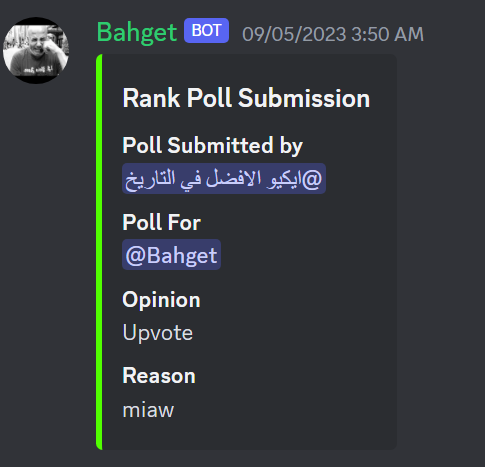

### How It Works

  

## how to configure it

- modify the values in config.py 

## How to make a rank poll for a user

go to the specified channel and type


```/submit_poll [username] [conclussion(up-down)] [reason] ```

*the rank poll will be sent to the #rankpool-admin-channel*



where an admin can approved it using this command

```/accept_poll [message-link]``` 

it will then be sent back to the #rankpoll-channel


 where upvotes and downvotes will be added to a database where we can make some rules like *-5 votes = downgrade*  and *+5 votes =upgrade then it gets cleared for them automatically  
 
 **this rule can be changed easily from the config.py file**

 

you can also do

```/clearvotes [username] [reason]``` to delete all the votes(points) that the user have

*you have to have administrator permissions to do this*

## how to suggest a discussion

  
```/submit_prompt [dissussion-prompt] [#channel-to-discuss-in]```

*it will be sent to the #discussion-pool-admin-channel


an admin can approve it by using  

```/accept_submission [message-link]``` 


it will then be sent back to the discussion channel


## Admin Controlled Environment

- if the admin sees that the user is trolling admin can use ```/down_vote [user] [N]``` *which will 
  add -`N` to his record in the database OR* ```/derank [user]``` *which will downgrade him and give him a lower rank*

- if the admin sees that the user is actively contributing to the server and is worth of an upgrade he can simply ```/up_vote [user] [N]``` *which will add +`N` to his record in the database* *OR* ```/upgrank[user]``` *which will upgrade him and give him a higher rank*


### miscellaneous commands

- `/clear [N]` deletes `N` messages if `N` = -1 it will delete the maximum amount of messages before discord stops the bot [100 messages] 

- `/ban [user] [reason]` bans the user from the guild and sends the user a dm explaining why he got banned 

- `/show_user_info` shows this message

  
  
